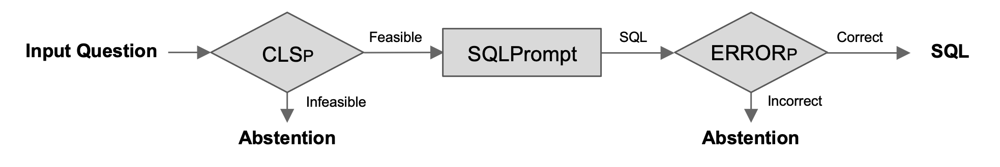

# TrustSQL: Benchmarking Text-to-SQL Reliability with Penalty-Based Scoring

## Overview

Text-to-SQL allows users to interact with databases using natural language, simplifying information retrieval without requiring special knowledge of databases or SQL. Despite the success of large language models in translating natural language to SQL, widespread deployment remains limited due to two main challenges: (1) users' lack of understanding of the models' capabilities (such as individual models' text-to-SQL generation capabilities, the scope of database contents, and SQL functionalities) and (2) the absence of abstention mechanisms, which can result in incorrect SQL generation going unnoticed.

We believe that building trust in model outputs is crucial for the broader adoption of text-to-SQL models. As a step towards this goal, we introduce TrustSQL, a new benchmark designed to evaluate text-to-SQL reliability, defined as a model's ability to accurately handle any type of input question (i.e., correct SQL generation for feasible questions and abstention for infeasible questions). TrustSQL contains four text-to-SQL datasets (ATIS, Advising, EHRSQL, and Spider), augmented with diverse infeasible questions regarding text-to-SQL tasks (e.g., questions that go beyond database contents and SQL functionalities).

With these diverse user questions, we allow models to have an option to abstain while generating SQL (termed reliable text-to-SQL modeling) and evaluate their performance using a novel penalty-based scoring metric, the Reliability Score (RS), tailored to measure text-to-SQL reliability. Due to the penalty term, the challenge in TrustSQL is not only to maximize correct SQL generation for feasible questions and abstention for infeasible questions but also to minimize mistakes in SQL generation (i.e., incorrect SQL generation for feasible questions and failure to abstain from generating SQL for infeasible questions).

The benchmark data is released along with our paper [TrustSQL: Benchmarking Text-to-SQL Reliability with Penalty-Based Scoring](https://arxiv.org/abs/2403.15879) (Preprint). For further details, please refer to the paper.


## Interactive Demo

<p align="middle" float="middle">
  
</p>

Please check out our [demo page](http://3.35.140.88:8501) for an interactive experience of the TrustSQL benchmark. It is important to note that the model used for this demo still makes mistakes in SQL generation. The goal of the TrustSQL benchmark is to remove these mistakes by allowing models to selectively generate only correct SQL among any input questions.


## Dataset

TrustSQL can be downloaded from this [Google Drive link](https://drive.google.com/file/d/1j0Otma8aC-e8-7ej-nwObpB-S-pxPpZX/view?usp=sharing). Locate the unzipped file in the main directory.

Text-to-SQL data is licensed under CC-BY-4.0. One of the four databases in TrustSQL is based on the MIMIC-IV demo. Please review the corresponding license terms on the [MIMIC-IV Demo website](https://physionet.org/content/mimic-iv-demo/2.2/) before use.

Each database consists of schema information (`tables.json`), actual database (`{database}.sqlite`), and text-to-SQL samples for each data split (`{database}_{split}.json`). Files ending with "combined_subset" contain TrustSQL samples combined with data sampled from question answering datasets (i.e., MS Marco, CoQA, and QuAC) to augment infeasible samples in the training and validation splits.


## Models

The TrustSQL benchmark can be addressed using two approaches: pipeline-based and unified. Below are three example methods utilizing OpenAI models.

### Pipeline-based Approach

1) CLS<sub>P</sub> → SQLPROMPT → ERROR<sub>P</sub>

<p align="left" float="middle">
  
</p>

```
bash ./script/run_clsprompt.sh # CLS_Prompt - Pre-abstention before SQL generation (i.e., filtering out infeasible questions)
bash ./script/run_sqlprompt.sh # SQLPrompt - SQL generation
bash ./script/run_errorprompt.sh # Error_Prompt - Post-abstention after SQL generation (i.e., filtering out incorrect SQL outputs)
```

### Unified Approach

2) SQLPROMPT[Demo]

<p align="left" float="middle">
  
</p>

```
bash ./script/run_sqlprompt_demo.sh # SQLPrompt[Demo] - SQL generation and abstention through demonstrations
```

3) SQLPROMPT[Voting]

<p align="left" float="middle">
  
</p>

```
bash ./script/run_sqlprompt_voting.sh # SQLPrompt[Voting] - SQL generation and abstention through voting 5 sampled outputs
```


## Evaluation

To evaluate the model performance, run the following code:

```
# 1) CLS_P → SQLPROMPT → ERROR_P
bash script/evaluate_sqlprompt_cls+error.sh
```

```
# 2) SQLPROMPT[Demo]
bash script/evaluate_sqlprompt_demo.sh
```

```
# 3) SQLPROMPT[Voting]
bash script/evaluate_sqlprompt_voting.sh
```


## Have Questions?

Ask us questions on our Github issues page or contact gyubok.lee@kaist.ac.kr.


## Citation

```
@article{lee2024trustsql,
  title={TrustSQL: Benchmarking Text-to-SQL Reliability with Penalty-Based Scoring}, 
  author={Lee, Gyubok and Chay, Woosog and Cho, Seonhee and Choi, Edward},
  journal={arXiv preprint arXiv:2403.15879},
  year={2024}
}
```
